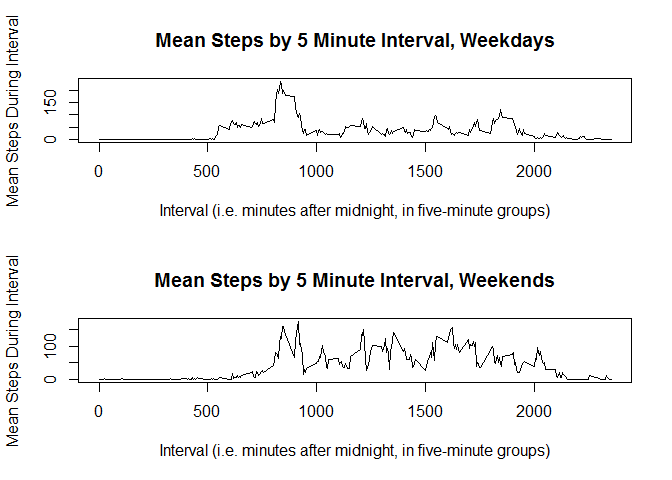

# Reproducible Research: Peer Assessment 1


## Loading and preprocessing the data

```r
library(lubridate)
dat <- read.table(unz("activity.zip", "activity.csv"), sep=",", header=TRUE, stringsAsFactors = FALSE)
dat$date <- ymd(dat$date)
head(dat)
```

```
##   steps       date interval
## 1    NA 2012-10-01        0
## 2    NA 2012-10-01        5
## 3    NA 2012-10-01       10
## 4    NA 2012-10-01       15
## 5    NA 2012-10-01       20
## 6    NA 2012-10-01       25
```

## What is mean total number of steps taken per day?

```r
totalPerDay <- tapply(dat$steps, factor(dat$date), sum, na.rm = TRUE)
meanPerDay <- mean(totalPerDay)
medianPerDay <- median(totalPerDay)
hist(totalPerDay, main="Histogram for Total Steps Per Day", xlab="Number of Steps Taken", breaks = 10)
```


The mean total steps per day is 9354.2295082 and the median total steps per day is 10395.

## What is the average daily activity pattern?

```r
meansPerInterval <- tapply(dat$steps, factor(dat$interval), mean, na.rm=TRUE)
plot(as.numeric(names(meansPerInterval)), 
     meansPerInterval, 
     type="l",
     main = "Mean Steps by 5 Minute Interval",
     xlab = "Interval (i.e. minutes after midnight, in five-minute groups)",
     ylab = "Mean Steps During Interval")
```


```r
intervalWithMostSteps <- names(meansPerInterval)[which.max(meansPerInterval)]
```
The interval with the highest mean number of steps is 835

## Imputing missing values

```r
library(dplyr)
```

```
## Warning: package 'dplyr' was built under R version 3.2.5
```

```r
anyValueIsNa <- is.na(dat$steps) | is.na(dat$date) | is.na(dat$interval)
totalNas <- sum(anyValueIsNa)
dat$dayOfWeek <- wday(dat$date)
meanIntervalByWeekday <- tapply(dat$steps, interaction(dat$interval, dat$dayOfWeek), mean, na.rm = TRUE)

typicalDay <- data.frame(steps = meanIntervalByWeekday, intervalDay = names(meanIntervalByWeekday))
typicalDay <- mutate(typicalDay, intervalDay = as.character(intervalDay))


imputeValues <- function(df) {
  intervalDayInput <- paste(as.character(df$interval), as.character(df$dayOfWeek), sep =  ".")
  df$intervalDay = intervalDayInput
  print(head(unique(df$intervalDay)))
  df <- df %>% left_join(typicalDay, c("intervalDay" = "intervalDay"))
  
  df <- rename(df, steps = steps.x, imputedValue = steps.y, weekday = dayOfWeek)
  
  ixesToUpdate <- which(is.na(df$steps))
  
  df$steps[ixesToUpdate] <- df$imputedValue[ixesToUpdate]
  print(head(df))
  df
}
withImputed <- dat
withImputed <- imputeValues(withImputed)
```

```
## [1] "0.2"  "5.2"  "10.2" "15.2" "20.2" "25.2"
##      steps       date interval weekday intervalDay imputedValue
## 1 1.428571 2012-10-01        0       2         0.2     1.428571
## 2 0.000000 2012-10-01        5       2         5.2     0.000000
## 3 0.000000 2012-10-01       10       2        10.2     0.000000
## 4 0.000000 2012-10-01       15       2        15.2     0.000000
## 5 0.000000 2012-10-01       20       2        20.2     0.000000
## 6 5.000000 2012-10-01       25       2        25.2     5.000000
```
The total number of rows with any missing value is 2304. 

To impute missing values, I took the average value for that interval for that weekday. For example, if a 745 on a Monday was missing, the mean of all recorded steps for 745 on Monday was used. 


```r
par(mfrow=c(1,2))
hist(withImputed$steps, main = "With Imputed Values", xlab = "Interval")
hist(dat$steps, main = "Without Imputed Values", xlab = "Interval")
```


```r
stepsPerDayWithImputed <- tapply(withImputed$steps, withImputed$date, sum)
meanWithImputed <- mean(stepsPerDayWithImputed)
meanWithImputed <- sprintf("%05.2f", meanWithImputed)
medianWithImputed <- median(stepsPerDayWithImputed)
medianWithImputed <- sprintf("%05.2f", medianWithImputed)
printMedian <- sprintf("%05.2f", medianPerDay)
printMean <- sprintf("%05.2f", meanPerDay)
```
It seems that the method of imputing the data has very little effect on its distribution. The mean steps per day with imputed values was 10821.21, and without imputed was 9354.23. The median with imputed values was 11015.00, and before the imputed data were added, the median was 10395.00.

## Are there differences in activity patterns between weekdays and weekends?

```r
library(ggplot2)
library(grid)
library(lattice)
sat <- 7; sun <- 1
isWeekend <- withImputed$weekday == sat | withImputed$weekday == sun
withImputed <- data.frame(withImputed, weekend = factor(isWeekend, labels=c("weekday", "weekend")))
weekendIntervals <- subset(withImputed, isWeekend)
weekdayIntervals <- subset(withImputed, !isWeekend)
weekdayMeansPerInterval <- tapply(weekdayIntervals$steps, factor(weekdayIntervals$interval), mean)
weekendMeansPerInterval <- tapply(weekendIntervals$steps, factor(weekendIntervals$interval), mean)
par(mfrow=c(2,1))
plot(as.numeric(names(weekdayMeansPerInterval)), 
     weekdayMeansPerInterval, 
     type="l",
     main = "Mean Steps by 5 Minute Interval, Weekdays",
     xlab = "Interval (i.e. minutes after midnight, in five-minute groups)",
     ylab = "Mean Steps During Interval")

plot(as.numeric(names(weekendMeansPerInterval)), 
     weekendMeansPerInterval, 
     type="l",
     main = "Mean Steps by 5 Minute Interval, Weekends",
     xlab = "Interval (i.e. minutes after midnight, in five-minute groups)",
     ylab = "Mean Steps During Interval")
```



